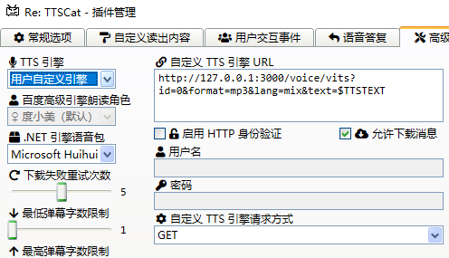

# BridgeBetweenDanmakuAndVits-api

## 这是什么

这是一个使用node.js写的服务器程序，可以将B站弹幕姬的RE:TTSCat插件的弹幕输出到此进行修改，随后发到[vits](https://github.com/Artrajz/vits-simple-api)，并播放合成的弹幕音频。

## 如何使用

1. 首先确保安装了node.js, ffmpeg。
2. 下载整个项目，在根目录打开控制台输入`node bridge.js`（或者直接打开那个`start.bat`）
3. 打开B站弹幕姬的RE:TTSCat插件的设置，在高级选项的自定义TTS引擎里填入如下内容，自然左边也要设置为“用户自定义引擎”
   `http://127.0.0.1:3000/voice/vits?id=0&format=mp3&lang=mix&text=$TTSTEXT`
4. 

> 都用vits-simple-api了这些应该都知道吧（

## 所以这有啥用？

* 作用就是可以让弹幕姬把数字当成中文来念  
  > 弹幕姬用vits-simple-api在语言识别上不能自己设置（反正我没找到办法），而自带的语言识别会把数字当成日语念，很多时候弹幕包含中文和数字的时候就会中日混杂的发音。　　

* 语言识别现在被转移到了该程序里面，所以如果觉得不好也可以按需修改。  
* 并且加入了字典，可以通过字典的设置，自动把设置好的词汇替换。  
  > 这个功能临时加的，反正照着dict.json里面的样子改就能用一用了

## 思路(这个刚开始写的，之后再改或者删了)

1. 开启本地主机上指定端口的监听
2. 解析弹幕姬tts插件发送的请求
3. 对需要语言合成的部分进行语言识别并做标记
   1. 中文：[ZH]
   2. 日文：[JA]
4. 发送请求到vits

> 吐槽：面向gpt编程了我属于是，反正最后弄出来了，并且这个一开始就是为了自己的需求整的，先这样吧。